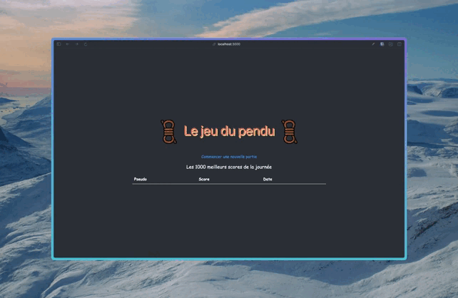

<div align='center'>
  
  [](https://hangman.thomaspsl.fr)
  
  # Hangman Project
  #### It's an [application](https://hangman.thomaspsl.fr) to play hangman and create some tests, built with [NodeJS](https://nodejs.org).

[](https://nodejs.org)
[](https://fr.reactjs.org)
[](https://www.sqlite.org/)

[](https://developer.mozilla.org/fr/docs/Learn/JavaScript)

[Contributors](#-contributors) • [Description](#-description) • [How To Use](#-how-to-use) • [Key Features](#-key-features)
• [Emailware](#-emailware) • [Credits](#-credits) • [Support](#-support) • [License](#-license)



</div>

<div>
    
  ## 👨‍🎓 Contributors
  

## 📚 Description

This is a small project to build a classic Hangman game in JavaScript.
The primary goal of this project is to practice and learn how to write tests using various tools and frameworks, including Jest.

**Test-Driven Development:** The project is structured to encourage writing tests for each feature of the game.

## 🚀 How To Use

To clone and run this application, you'll need [Git](https://git-scm.com) (which comes with [npm](https://www.npmjs.com)) installed on your computer.
From your command line:

```bash
# Clone this repository
$ git clone https://github.com/thomaspsl-org/hangman-app

# Go into the repository
$ cd hangman-app

# Install dependencies
$ npm install

# Run the app
$ npm start

# Run tests
$ npm test
```

## 🔑 Key Features

...

## 📮 Emailware

Hangman is an [emailware](https://en.wiktionary.org/wiki/emailware). Meaning, if you liked using this app or it has helped you in any way,
I'd like you send me an email at <contact@thomaspsl.fr> about anything you'd want to say about this web software. I'd really appreciate it!

## ✨ Credits

[](https://mongoosejs.com)
[](https://pm2.keymetrics.io)
[](https://pm2.keymetrics.io)

## 💸 Support

[](https://www.patreon.com)
[](https://www.paypal.com)

## 🔒 License

MIT

</div>

<div align='center'>  
  
  Instagram [Incoming...]() • GitHub [@thomaspsl](https://github.com/thomaspsl) • Twitter [@thomaspssl](https://twitter.com/thomaspssl)
  
</div>
